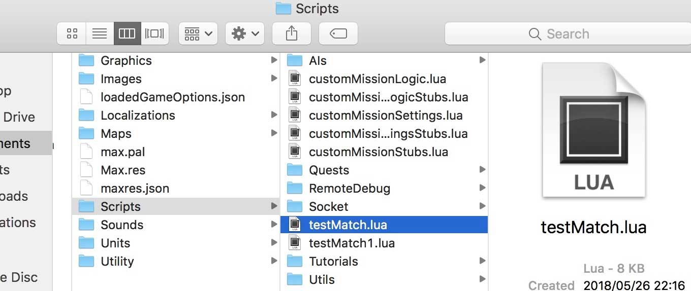
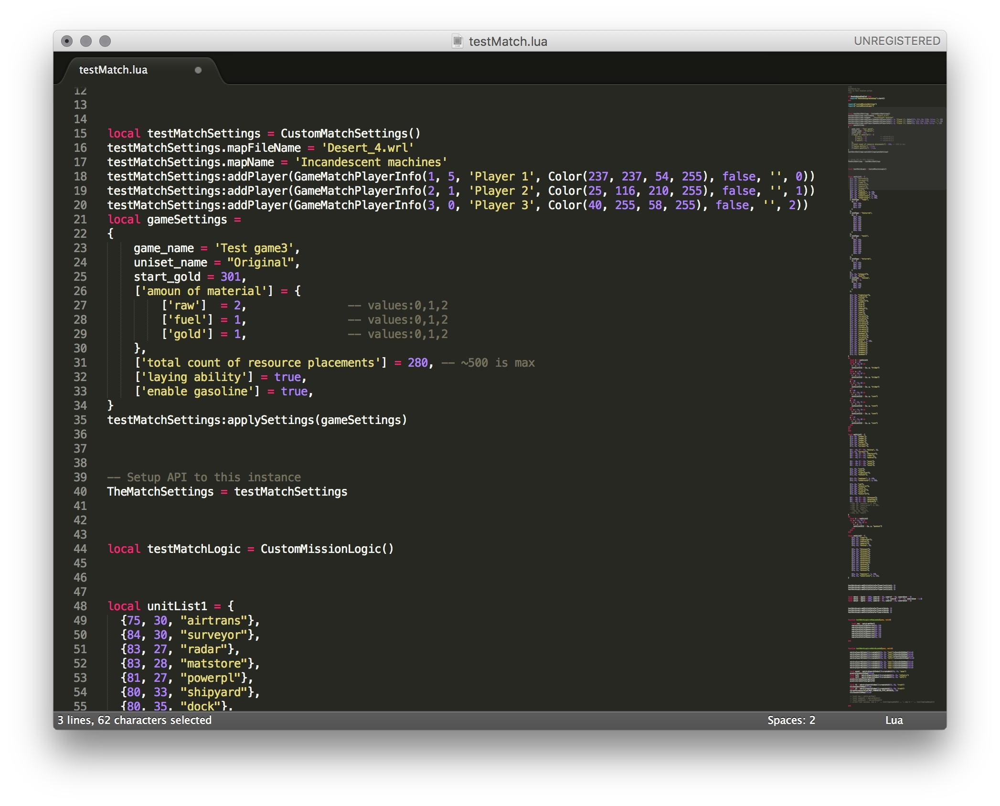

# Initialization scripting

This guide will explain the process of creating **initScript.lua** - script that defines a phase of match initialization.

# Table of Contents
1. [Overview](#Overview)
2. [Structure](#Structure)
3. [Settings and players](#Settings-and-players)
4. [Adding units](#Adding-units)
    1. [Using Unit List](#Using-Unit-List)
    2. [Using Complex Plan export feature](#Using-Complex-Plan-export-feature)
5. [Player status](#Player-status)
6. [Loading Phases](#Loading-Phases)
    1. [Map loaded](#Map-loaded)
    2. [Match loaded](#Match-loaded)
    3. [Match prepared](#Match-prepared)
7. [Done!](#Done!)

Example scenarios:
- [Alien Attack](../Examples/Alien_attack/initScript.lua)
- [Tank horde](../Examples/Tank_horde/initScript.lua)
- [Man versus Machine](../Examples/Man_versus_Machine/initScript.lua)
- [Test AI](../Examples/Test_AI/initScript.lua)

## Overview

Initialize script will specify:
- game information: name, description
- uniset
- map
- resource map
- players
- initial units
- initial upgrades

To start creating your scenario you should open test match script which is located in game resources folder: **Resources/Scripts/testMatch.lua**:

  

You can open it with any text editor, I would recommend you Visual Studio Code, Atom, Sublime Text or Notepad++ because they have option to highlight script syntax, it is very useful.

In order to run the script, start the game, go LOCAL GAME and press small `{>}` button on the top-left corner of the screen. Game will start a local game with the content of `testMatch.lua`.

## Structure

Lets look at the script structure

 

## Settings and players
```
local testMatchSettings = CustomMatchSettings()
```
Here we create game settings - defining rules, map, players, game name and so on. Multiplayer scenario will be little bit different, but basic idea will be the same.

## Adding units
### Using Unit List
You can add many units by simple setup list of units with some starting parameters.
```
local unitList1 = {
    ...
}
testMatchLogic:addInitialUnitsForPlayer(unitList1, 1)
```
Here we defining units for player1.

Unit List parameters examples:
```
{31, 50, "fuelstore", UNIT_PARAMETER_TYPE_FUEL, 10}
```
Create Fuel Store on position (31, 50) and set Fuel to 10. This is old format and not recommended for usage.
Recommended format:
```
{32, 50, "matstore", {material = 42, name = 'matStore1'}}
```
Creates Material Store on position (32, 50) and set Materials to 42.
Also this unit give name "matStore1". This name can be used for quick access later in script.
All list of supported parameters:
```
material = 42 -- set materials
fuel = 10 -- set fuel
gold = 20 -- set gold
turn_on = 1 -- turn on building or unit. Default action is place on map
name = 'unit_name' -- set unit name for access later in script or engine
produce = 'type' -- set unit type for producing. See unit:setBuildUnit(produce, speed)
speed = 1 -- set unit speed fo producing. See unit:setBuildUnit(produce, speed)
```
### Using Complex Plan export feature
You also can create units in onMatchLoaded(game, match) method described is section [Match loaded](#Match-loaded).
There are feature for simplify this process.
Start Local Game (one or more for each players you needed to setup with same settings and map).
Place units and buildings you needed to export during Complex Plan mode and then select: Menu/Save Game.
The new file units.lua will be saved to document directory (same location as options.json, savegames etc.).
Open this file and copy any code you needed to your Script.
Generated code declare all nessesary variables and require only Match var as input value.
```
local match = Match
```
Remove this line of code if you will paste all of generated code under the onMatchLoaded method.
The generated code contained logic for:
1. place units you place to map in Complex Plan mode
2. setup Resource map with same resources values under all Mining Stations
3. create units stored to any transports
4. turn on all units which turn on in Complex Plan Mode. This action located after all unit and building creations
5. store units in transports

You can use this generated code, insert it to onMatchLoaded method. If some changes required after you test new match then you can load saved Complex Plan, make changes and save again fo reexport new units.lua file.
Tou can create more local saves for each player and use they for reexport player units you needed to modify. Test it anr load againg for new changes and reexport.

## Player status
```
local data1 = {gold = 1000, cameraX = 83, cameraY = 30, cameraZoom = 1}
```
It means start gold, initial camera position and scale.

## Loading Phases

### Map loaded
---
```
function testMatchLogic:onMapLoaded(game, match)
```
This function called when map is initialized. Resources are generated randomly so in order to place mining stations we should define resource fields.

Example of adding initial mineral field:
```
function testMatchLogic:onMapLoaded(game, match)

    -- put resource field
    local map = match:getMap()
    map:placeInitialResources(38, 38)

end
```

### Match loaded
---
```
function testMatchLogic:onMatchLoaded(game, match)
```

This function called when everything is loaded and initial units specified before was added. You can still add units using different syntax.

```
function testMatchLogic:onMatchLoaded(game, match)

    -- create interceptor
    match:playerAtIndex(2):createUnit(62, 41, 'inter'):placeUnitOnMap(false)

    -- create APC with 2 infiltrators inside
    local pcan1 = match:playerAtIndex(2):createUnit(69, 44, 'pcan')
    pcan1:placeUnitOnMap(false)
    local inf1 = match:playerAtIndex(2):createUnit(69, 43, 'infantry')
    local inf2 = match:playerAtIndex(2):createUnit(69, 43, 'infil')
    pcan1:storeUnitToCargo(inf1)
    pcan1:storeUnitToCargo(inf2)

    -- create truck with minerals
    local truck1 = match:playerAtIndex(2):createUnit(36, 59, 'truck')
    truck1:setParameterValue(UNIT_PARAMETER_TYPE_MATERIAL, 50)
    truck1:placeUnitOnMap(false)

    -- add attack upgrade to Artillery
    match:playerAtIndex(1):addUnitTypeUpgrade('arturret', UNIT_PARAMETER_TYPE_ATTACK, 2)

end
```
See section [Using Complex Plan export feature](#Using-Complex-Plan-export-feature) for simplify unit cretions.

### Match prepared
---
```
function testMatchLogic:onMatchPrepared(game, match)
```
This function called when after everything is prepared to game. Here you can set last parameters that will be applied after applying initial upgrades, placement logic and so on.

```
function testMatchLogic:onMatchPrepared(game, match)

    -- get awac and set 1 gasoline to it
    local awac = match:playerAtIndex(2):getUnitWithId(4)
    awac:setParameterValue(UNIT_PARAMETER_TYPE_GAS, 10)

end
```


## Done!

After you modified testMatch.lua script you should save it (please keep original copy), overwrite existing script, and start test match in game to see your changes in game.


