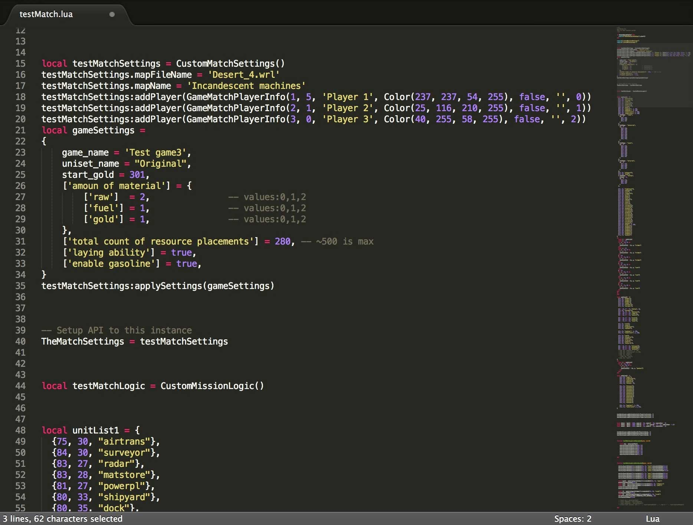

# Initialization scripting

This guide will explain the process of creating initScrip.lua - script that defines a phase of match initialization.

Example scenarios:
- [Alien Attack](../Examples/Alien_attack/initScript.lua)
- [Tank horde](../Examples/Tank_horde/initScript.lua)
- [Man versus Machine](../Examples/Man_versus_Machine/initScript.lua)

## Overview

Initialize script will specify:
- game information: name, description
- uniset
- map
- resource map
- players
- initial units
- initial upgrades

To start creating your scenario you should open test match script which is located in game resources folder: **Resources/Scripts/testMatch.lua**:

  

You can open it with any text editor, I would recommend you Visual Studio Code, Atom, Sublime Text or Notepad++ because they have option to highlight script syntax, it is very useful.

## Structure

Lets look at the script structure

 

## Settings and players
```
local testMatchSettings = CustomMatchSettings()
```
Here we create game settings - defining rules, map, players, game name and so on. Multiplayer scenario will be little bit different, but basic idea will be the same.

## Adding units
```
local unitList1 = {
    ...
}
testMatchLogic:addInitialUnitsForPlayer(unitList1, 1)
```
Here we defining units for player1. 

## Player status
```
local data1 = {gold = 1000, cameraX = 83, cameraY = 30, cameraZoom = 1}
```
It means start gold, initial camera position and scale.

## Loading Phases

### Map loaded
---
```
function testMatchLogic:onMapLoaded(game, match)
```
This function called when map is initialized. Resources are generated randomly so in order to place mining stations we should define resource fields.

Example of adding initial mineral field:
```
function testMatchLogic:onMapLoaded(game, match)

    -- put resource field
    local map = match:getMap()
    map:placeInitialResources(38, 38)

end
```

### Match loaded
---
```
function testMatchLogic:onMatchLoaded(game, match)
```

This function called when everything is loaded and initial units specified before was added. You can still add units using different syntax.

```
function testMatchLogic:onMatchLoaded(game, match)

    -- create interceptor
    match:playerAtIndex(2):createUnit(62, 41, 'inter'):placeUnitOnMap(false)

    -- create APC with 2 infiltrators inside
    local pcan1 = match:playerAtIndex(2):createUnit(69, 44, 'pcan')
    pcan1:placeUnitOnMap(false)
    local inf1 = match:playerAtIndex(2):createUnit(69, 43, 'infantry')
    local inf2 = match:playerAtIndex(2):createUnit(69, 43, 'infil')
    pcan1:storeUnitToCargo(inf1)
    pcan1:storeUnitToCargo(inf2)

    -- create truck with minerals
    local truck1 = match:playerAtIndex(2):createUnit(36, 59, 'truck')
    truck1:setParameterValue(UNIT_PARAMETER_TYPE_MATERIAL, 50)
    truck1:placeUnitOnMap(false)

    -- add attack upgrade to Artillery
    match:playerAtIndex(1):addUnitTypeUpgrade('arturret', UNIT_PARAMETER_TYPE_ATTACK, 2)

end
```

### Match prepared
---
```
function testMatchLogic:onMatchPrepared(game, match)
```
This function called when after everything is prepared to game. Here you can set last parameters that will be applied after applying initial upgrades, placement logic and so on.

```
function testMatchLogic:onMatchPrepared(game, match)

    -- get awac and set 1 gasoline to it
    local awac = match:playerAtIndex(2):getUnitWithId(4)
    awac:setParameterValue(UNIT_PARAMETER_TYPE_GAS, 10)

end
```


## Done!

After you modified testMatch.lua script you should save it (please keep original copy), overwrite existing script, and start test match in game to see your changes in game.


