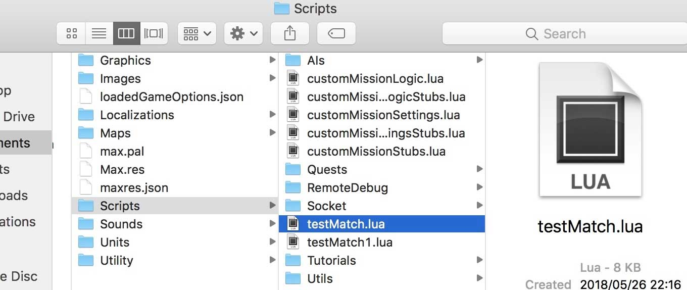

# MACS-docs

This repo contains documentation and specifications for MACS (Mechanized Assault Commanders) build-in scripting system

## Table of Contents
1. [Overview](#Overview)
    - [Useful Hints](#Useful-hints)
2. [Scripting](#Scripting)
    1. [Loading Scripts](#Loading-Scripts)
    2. [Executing Scripts](#Executing-Scripts)
    3. [Testing Scripts](#Testing-Scripts)
    4. [Uploading scenarios for community](#Uploading-scenarios-for-community)
2. [API Specification](##API-Specification)
    1. [Constants](###Constants)
    2. [Structures](###Structures)
    3. [Objects](###Objects)
3. [Event System](#Event-System)
4. [Quest System](#Quest-System)

## Overview

This specification explains about MACS embedded scripting API. Using this API you can write your own scenarios.

The script can be used to initialize the match by modifying the initail game conditions, or affect the game itself by modifying in-game behavior.

### Useful hints

- **In order to find unit types**, open **Units/originalUniset.json**, refer to **_type** value. For example, **Heavy vehicle plant** is **hvplant**.
- **In order to find available maps** refer to **loadedRemoteMaps.json** in **Saves** folder. You should put desired map's **file** property + **.wrl**, for example **224x2246.wrl** to start on **Revelation** map.

## Scripting

### Loading Scripts

Game loads the file named initScript.lua. The file should be located in root directory of the scenario's zip arhive.

For details about initializion script please refer to [Scripting Guide](Guides/Scripting.md).

### Executing Scripts

Scripts will be running on the main thread so please avoid 

The script will be provided with a memory pool that is not syncronized between players you should not retain any objects in script variables outside of the API methods. Instead, you need to retrieve a needed data on-the-fly.

You can still create some global structure the first time you run the script, but remember that you do this at your own risk, and it is entirely up to you to keep that structure (and all the script behvior derrived from it) reproducible.

Our recommendation is to follow the stateless approach as much as possible, leaving the management of persistent data to the hosting game.

### Testing Scripts

To start creating your scenario you should open test match script which is located in game resources folder: **Resources/Scripts/testMatch.lua**:

  

You can open it with any text editor, I would recommend you Visual Studio Code, Atom, Sublime Text or Notepad++ because they have option to highlight script syntax, it is very useful.

In order to run the script, start the game, go LOCAL GAME and press small `{>}` button on the top-left corner of the screen. Game will start a local game with the content of `testMatch.lua`.

For details about initializion script please refer to [Scripting Guide](Guides/Scripting.md).

### Uploading scenarios for community

After you done with your scenario and want to show it to community you should do following steps:

1. rename initialization script file (**testMatch.lua** file) into **initScript.lua**
2. zip this file into arhive. Archive should contains this file in a root folder.
3. go to website https://macsgame.com/#
4. naviage to **MY -> My Scenarios:** https://macsgame.com/my/scenarios.html
5. Choose **Create New** https://macsgame.com/my/edit-scenario.html
6. Press **Choose File** button and select your zip archive
7. Website will parse your script file and show its data. Press **Add**
8. Now your script is uploaded. Press **Ready** and **Save** to show it in the game.

Now new scenario should appear for you in game.

On scenarios page (navigate to **Game -> Scenarios** https://macsgame.com/game/scenarios.html ) you can see all available scenarios. 

Choose any scenario created by other member (for example: https://macsgame.com/game/scenario/3.html) and press **Add to my list**  in order to see it in game.

## API Specification

This section contains information about objects and its APIs that hosting application exposes to lua side. 

**Structures** are passed to script by value with transferring ownership into lua.

**Objects** will be passed by pointer and will stay owned/managed by MACS engine. Do not retain them for a long time - basically script will not know when object will be deleted.

### Constants

[API's contstants description](API/Constants.md)

### Structures

- [Color](API/Structures.md##Color)
- [Rect](API/Structures.md##Rect)
- [Size](API/Structures.md##Size)
- [Point](API/Structures.md##Point)
- [GameMatchSettings](API/GameMatchSettings.md)
- [GameMatchPlayerInfo](API/GameMatchPlayerInfo.md)
- [GameMatchDeployLogic](API/GameMatchDeployLogic.md)
- [GameEvent](API/GameEvent.md)

### Objects

- [GameMap](API/GameMap.md)
- [GameMatch](API/GameMatch.md)
- [GameMatchPlayer](API/GameMatchPlayer.md)
- [GameUnit](API/GameUnit.md)

## Event System

Built-in event system allow you to track and handle some game events.

## Quest System

Quest system is based on handling events.
